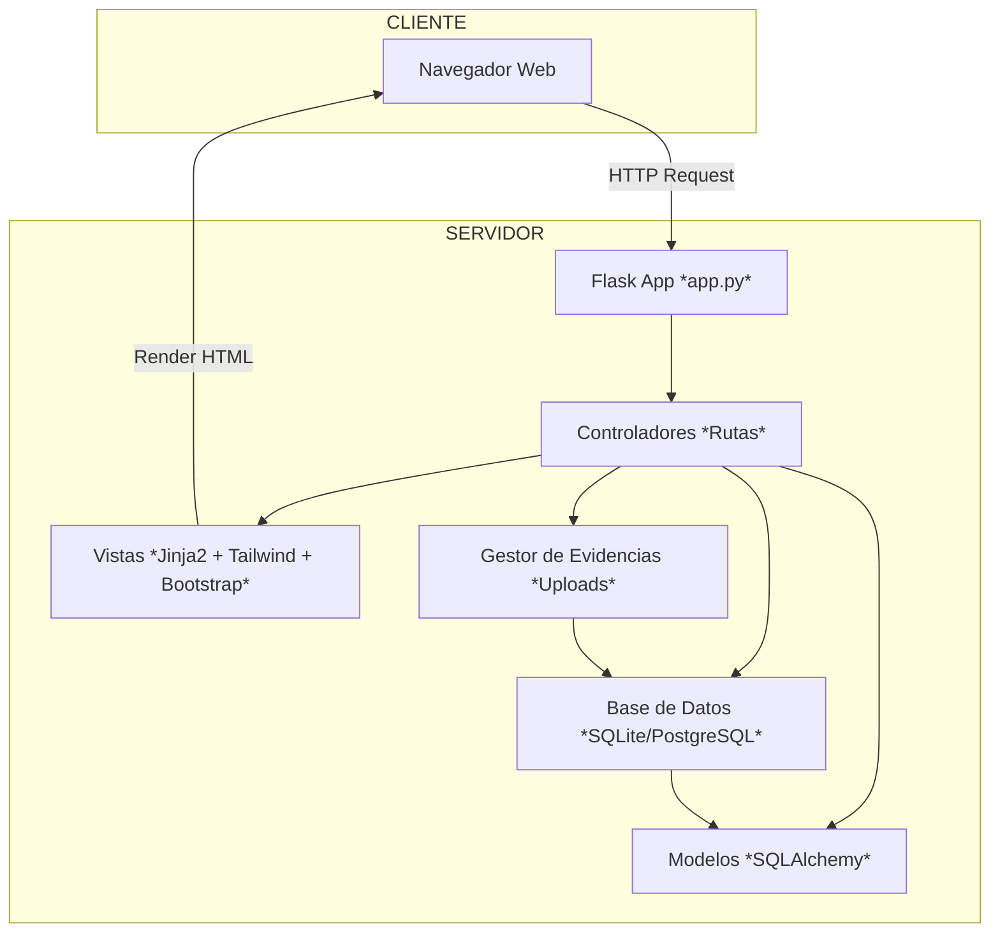
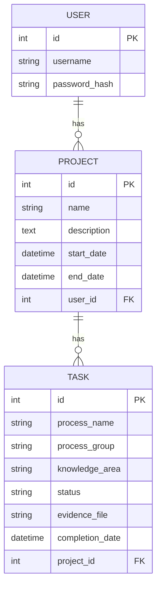

# 📘 PMBOK Tracker Flask — Memoria Técnica


---

## 📌 Descripción General

**PMBOK Tracker Flask** es un **sistema web de gestión de proyectos** desarrollado como MVP (**Producto Mínimo Viable**) para aplicar de forma práctica los **49 procesos de la Guía PMBOK® 6ª Edición**.  
Permite registrar proyectos, gestionar tareas vinculadas a los procesos PMBOK, cargar **evidencias documentales**, y monitorear el avance mediante una barra de progreso visual.

El sistema está diseñado bajo una arquitectura **monolítica** utilizando **Flask**, un framework **micro** de Python para desarrollo web, elegido por su **simplicidad, velocidad de despliegue** y **compatibilidad con contenedores Docker**.

---

## 🎯 Objetivo del Proyecto

- **Facilitar la aplicación práctica** de los procesos PMBOK en proyectos reales.
- Automatizar la creación de tareas alineadas al ciclo de vida del proyecto.
- Gestionar **evidencias de cumplimiento** de cada proceso.
- Brindar **trazabilidad**, control y avance del proyecto de forma visual y centralizada.

---

## 🧩 ¿Por qué una arquitectura monolítica?

La **arquitectura monolítica** se eligió porque:

- Es ideal para MVPs de rápida iteración.
- Reduce la complejidad operativa (no requiere orquestadores, API Gateway ni configuración distribuida).
- Mantiene todos los componentes **(rutas, lógica de negocio, plantillas y persistencia)** dentro de una misma base de código, facilitando la mantenibilidad en fases tempranas.
- Permite migrar progresivamente a una arquitectura **modular** o de **microservicios** en etapas futuras, desacoplando módulos críticos como autenticación, carga de archivos o API REST.

---

## 🏛️ Arquitectura Lógica

El proyecto implementa un **patrón de diseño MVC** (*Modelo–Vista–Controlador*).

- **Modelos (`models.py`):** Definen la estructura de la base de datos con SQLAlchemy. Incluyen `User`, `Project` y `Task`.
- **Vistas (`templates/`):** Plantillas Jinja2 renderizadas dinámicamente con TailwindCSS y Bootstrap 5 vía CDN para una interfaz **responsive** y clara.
- **Controladores (`app.py`):** Contienen las rutas Flask, manejo de sesiones, validación de datos y operaciones CRUD.

---

## 📈 Diagrama de Arquitectura — Mermaid

El siguiente diagrama describe la **arquitectura Cliente-Servidor Monolítica** implementada:



---

## 🗂️ Estructura de Carpetas

```
pmbook_tracker/
│
├── app.py             # Entrypoint Flask, rutas y lógica
├── models.py          # Modelos SQLAlchemy: User, Project, Task
├── config.py          # Configuración (DB URI, claves)
├── templates/         # Plantillas Jinja2 (base, login, registro, dashboard)
├── static/uploads/    # Evidencias documentales
├── requirements.txt   # Dependencias Python
├── Dockerfile         # Imagen Docker lista
├── README.md          # Documento técnico
```

---

## 🗃️ Diagrama Entidad-Relación (simplificado)



---

## ⚙️ Detalles Técnicos

* **Lenguaje:** Python 3.9+
* **Framework:** Flask
* **ORM:** SQLAlchemy
* **Autenticación:** Flask-Login
* **Frontend:** Jinja2 + TailwindCSS + Bootstrap 5 vía CDN
* **Base de datos:** SQLite (desarrollo), PostgreSQL (producción listo)
* **Contenedorización:** Docker
* **Seguridad:**

  * Control de extensiones de archivos (`pdf`, `docx`, `jpg`, `png`).
  * Uso de `secure_filename` para nombres sanitizados.
  * Carpetas de evidencias separadas.

---

## 📂 Flujos principales

1️⃣ **Registro/Login**
Los usuarios se registran con nombre de usuario y contraseña. Las credenciales se almacenan con hash.

2️⃣ **Creación de proyecto**
Cada usuario puede registrar múltiples proyectos con fechas y descripción.

3️⃣ **Carga automática de procesos PMBOK**
Al crear un proyecto, se generan automáticamente las 49 tareas alineadas a PMBOK 6th Ed.

4️⃣ **Actualización de tareas**
Cada tarea puede marcarse como Pendiente, En Proceso o Terminada. Para marcar como *Terminado* es **obligatorio** subir una evidencia.

5️⃣ **Descarga de evidencias**
Los usuarios pueden consultar y descargar los archivos subidos como respaldo documental.

---

## 📌 Justificación del uso de contenedores

* Garantiza que la app se ejecute **idéntica en todos los entornos** (desarrollo, testing, producción).
* Simplifica la configuración de dependencias.
* Permite escalar con orquestadores (Kubernetes, Swarm) en caso de migrar a microservicios.
* Evita conflictos de versiones Python o paquetes.

---

## 🗓️ Roadmap de evolución

✅ MVP funcional con arquitectura monolítica.
🚧 Próximos pasos:

* Desacoplar módulos críticos como autenticación y carga de archivos a microservicios independientes.
* Implementar una **API RESTful** para integrarse con bots o aplicaciones móviles.
* Mejorar auditoría y trazabilidad con logs de cambios.
* Desplegar en **cloud providers** (Heroku, AWS, Azure, actualmente en contenedor de HugggingFace Space).
* Extender soporte multi-idioma (i18n).

---

## ⚖️ Licencia

MIT — Uso libre con atribución.
Desarrollado como parte del **Curso de Gestión de Proyectos de TI 2025-I**.

---

## 📚 Referencias

* Guía PMBOK® 6th Edition — PMI.
* Flask Official Docs — flask.palletsprojects.com
* Docker Official Docs — docs.docker.com
